# 生命周期图解

图解用于展示生命周期关系、人机协作、制品流转和活动组织方式。读图时关注反馈如何融入构建、活动如何组合、设计的不同来源，以及独立验收的职责边界。

## 生命周期与反馈返回

目标与最小准备进入可组合开发活动（原型构建、重构、审查、精修，默认顺序可裁剪合并），构建内含体验反馈与需求澄清循环。独立验收只读固定候选，通过后直接本地发布并进入维护；验收不通过、维护问题经 A15、以及下一轮演化都返回开发活动。

## 人机协作方式

四个协作环：构建内反馈同步 A03、A10、A11 并以 A23 记录版本、模拟边界与确认来源；实现解读 A25 支持人分层审阅并下钻到代码；同类问题排查按根因全项目检索，分类确认后修复回归并沉淀 A26 与 A08 规则；设计 AI、人工或外包、混合来源汇入 A27 统一交付包，经人确认后实施 A05 与 A11。

## 制品流转与追踪

A01–A27 按用途分为九组，主流程为目标与规格、设计与约束、计划与实现、审查与交接、验收与追踪、发布与维护；A23–A27 承载原型版本确认、重构方案、实现解读、同类排查与设计交付；A16 持续汇聚追踪，A21 与 A22 作为实证旁路。返回、失效与重验关系以各制品规范和生命周期图为准。

## 活动组织方式

活动可按功能并行、按迭代顺序或混合组织，裁剪选择记录在 A10 计划。并行功能共享 A01、A02、A08 约束，经集成点与集成验证形成集成候选进入 A12 与 A14；混合组织的冲突与缺陷经 A15、A16 处理后再集成。

[生成说明](diagrams/README.md)列出源码、配置和渲染工具要求。导出图由 `.mmd` 源码生成，修改源码后必须重新导出并核对图文语义与视觉可读性。
